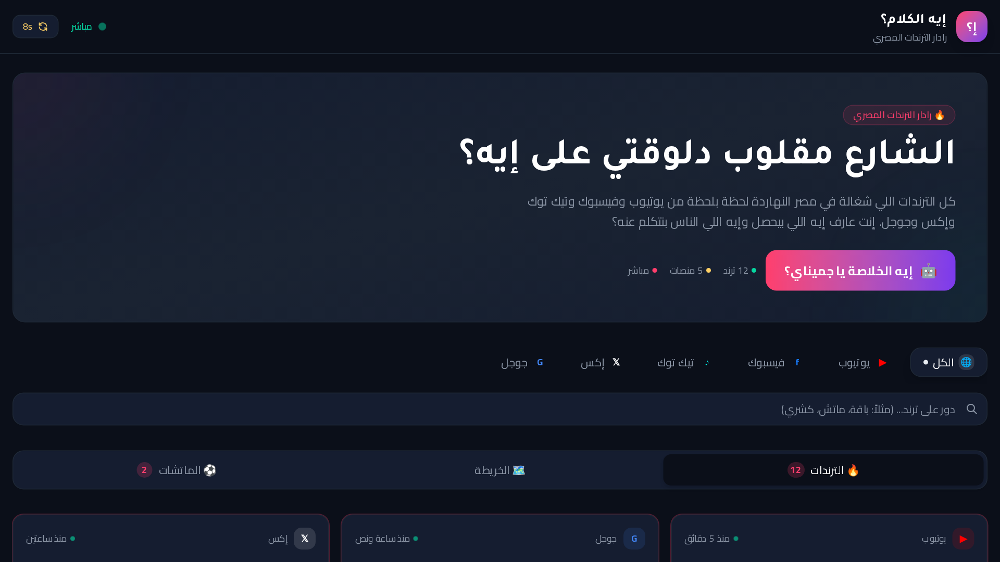

<div align="center">


## 📸 لقطات الشاشة | Screenshots



# 🔥 إيه الكلام؟ | Eah ElKalam?

### رادار الترند المصري — تابع أحدث الترندات في الوقت الحقيقي مع تحليلات ذكية
### Egyptian Trend Radar — real-time trending topics & smart analysis

[](https://eah-elkalam.vercel.app)
[](https://github.com/ziadamr45/Eah-Elkalam)

</div>

---

## 📖 نبذة

<div dir="rtl">

**إيه الكلام؟** هو رادار الترند المصري الذي يتتبع أحدث الترندات في الوقت الحقيقي مع تحليلات ذكية ومتقدمة. يوفر التطبيق خريطة مصر تفاعلية لاستكشاف الترندات جغرافيًا، بحث وفلترة حسب المنصة، مطابقات مباشرة للترندات المشابهة، وواجهة طرفية تفاعلية فريدة تمنحك تجربة مختلفة. مبني بتقنيات حديثة لتجربة سريعة وسلسة.

</div>

## ✨ المميزات

| الميزة | الوصف |
|--------|-------|
| 📊 تتبع الترندات في الوقت الحقيقي | تابع أحدث الترندات لحظة بلحظة |
| 🤖 تحليلات ذكية ومتقدمة | تحليل عميق للترندات |
| 🗺️ خريطة مصر التفاعلية | استكشف الترندات جغرافيًا |
| 🔍 بحث وفلترة حسب المنصة | ابحث وصفّي حسب المنصة |
| 📱 تصميم متجاوب بالكامل | يعمل على جميع الأجهزة |
| 🌙 وضع داكن/فاتح | اختر المظهر المناسب لك |
| 🎯 مطابقات مباشرة للترندات | ترندات مشابهة في الوقت الحقيقي |
| 🖥️ واجهة طرفية تفاعلية | تجربة طرفية تفاعلية فريدة |

## 🛠️ التقنيات

| التقنية | الاستخدام |
|---------|-----------|
|  | إطار العمل الكامل |
|  | تطوير آمن بالأنواع |
|  | التصميم |
|  | مكونات واجهة المستخدم |
|  | ORM لقاعدة البيانات |
|  | الحركات والأنيميشن |
|  | النشر والاستضافة |
|  | مكتبة واجهة المستخدم |
|  | نظام المصادقة |
|  | مكونات أساسية يمكن الوصول إليها |
|  | إدارة الحالة |
|  | الرسوم البيانية التفاعلية |
|  | إدارة النماذج |
|  | التحقق من البيانات |
|  | السحب والإفلات |
|  | الإشعارات المنبثقة |
|  | العروض المتحركة والكاروسيل |
|  | أيقونات واجهة المستخدم |
|  | التحكم بالإصدارات |
|  | بيئة التشغيل |
|  | مدير الحزم والوقت الحقيقي |
|  | تدويل اللغات (i18n) |
|  | إدارة السمات (داكن/فاتح) |
|  | إدارة البيانات والطلبات |
|  | معالجة الصور |
|  | لوحة أوامر سريعة |
|  | معالجة التواريخ |
|  | جداول بيانات متقدمة |
|  | محرر محتوى MDX |
|  | عرض المحتوى Markdown |
|  | فحص وتنسيق الكود |

## 🚀 التشغيل

### المتطلبات

- Node.js 18+ أو Bun
- npm أو yarn أو bun

### التثبيت

```bash
# استنساخ المستودع
git clone https://github.com/ziadamr45/Eah-Elkalam.git
cd Eah-Elkalam

# تثبيت التبعيات
npm install

# إعداد متغيرات البيئة
cp .env.example .env
# عدّل ملف .env بالإعدادات المطلوبة

# تشغيل تهجيرات قاعدة البيانات
npx prisma migrate dev

# تشغيل خادم التطوير
npm run dev
```

التطبيق سيعمل على `http://localhost:3000`

### 📜 الرخصة

هذا المشروع متاح **للعرض والاطلاع فقط**. لا يمكن نسخ الكود أو إعادة إنتاجه أو استخدامه في مشاريع أخرى.

---

### 👨‍💻 المطور

**زياد عمرو (Ziad Amr)**

- 🌐 الموقع الشخصي: [ziadamrme.vercel.app](https://ziadamrme.vercel.app)
- 💼 GitHub: [ziadamr45](https://github.com/ziadamr45)
- 📘 Facebook: [ziad7mr](https://www.facebook.com/ziad7mr)
- 💬 Telegram: [@ziadamr](https://t.me/ziadamr)
- 📸 Instagram: [ziadamr455](https://www.instagram.com/ziadamr455/)
- 🧵 Threads: [@ziadamr455](https://www.threads.com/@ziadamr455)
- 🐦 X: [@ziad90216](https://x.com/ziad90216)
- 🎥 YouTube: [@alhayat_ala_eltarek](https://youtube.com/@alhayat_ala_eltarek?si=pcsc_31Kcv3Jym14)
- 💼 LinkedIn: [ziad-amr](https://www.linkedin.com/in/ziad-amr-44633a411)
- 📧 Email: ziad90216@gmail.com

---

<p align="center">
  مدعوم بواسطة <a href="https://ziadamrme.vercel.app/">زياد عمرو</a>
</p>

---

## English


**Eah ElKalam?** is an Egyptian trend radar that tracks real-time trending topics with smart and advanced analysis. The app features an interactive Egypt map to explore trends geographically, search and filter by social platform, live trend matching for similar trends, and a unique interactive terminal console that gives you a different experience. Built with modern technologies for a fast and smooth experience.

### Features

| Feature | Description |
|---------|-------------|
| 📊 Real-time trend tracking | Follow the latest trends as they happen |
| 🤖 Smart trend analysis | Deep analysis of trending topics |
| 🗺️ Interactive Egypt map | Explore trends geographically |
| 🔍 Search & filter by platform | Search and filter by social platform |
| 📱 Fully responsive design | Works on all devices |
| 🌙 Dark/Light mode | Choose your preferred theme |
| 🎯 Live trend matching | Similar trends in real time |
| 🖥️ Interactive terminal console | Unique interactive terminal experience |

### Tech Stack

| Technology | Purpose |
|------------|---------|
|  | Fullstack Framework |
|  | Type-safe Development |
|  | Styling |
|  | UI Components |
|  | Database ORM |
|  | Animations |
|  | Deployment |
|  | UI Library |
|  | Authentication |
|  | Accessible Primitive Components |
|  | State Management |
|  | Interactive Charts |
|  | Form Management |
|  | Data Validation |
|  | Drag & Drop |
|  | Toast Notifications |
|  | Carousels & Sliders |
|  | UI Icons |
|  | Version Control |
|  | Runtime Environment |
|  | Package Manager & Runtime |
|  | Internationalization (i18n) |
|  | Theme Management (Dark/Light) |
|  | Data Fetching & Caching |
|  | Image Processing |
|  | Command Palette |
|  | Date Utilities |
|  | Advanced Data Tables |
|  | MDX Content Editor |
|  | Markdown Rendering |
|  | Code Linting & Formatting |

### Getting Started

#### Prerequisites

- Node.js 18+ or Bun
- npm, yarn, or bun

#### Installation

```bash
# Clone the repository
git clone https://github.com/ziadamr45/Eah-Elkalam.git
cd Eah-Elkalam

# Install dependencies
npm install

# Set up environment variables
cp .env.example .env
# Edit .env with your configuration

# Run database migrations
npx prisma migrate dev

# Start development server
npm run dev
```

The app will be available at `http://localhost:3000`

### License

This project is available for **viewing and reference only**. The code cannot be copied, reproduced, or used in other projects.

---

### 👨‍💻 Developer

**Ziad Amr**

- 🌐 Portfolio: [ziadamrme.vercel.app](https://ziadamrme.vercel.app)
- 💼 GitHub: [ziadamr45](https://github.com/ziadamr45)
- 📘 Facebook: [ziad7mr](https://www.facebook.com/ziad7mr)
- 💬 Telegram: [@ziadamr](https://t.me/ziadamr)
- 📸 Instagram: [ziadamr455](https://www.instagram.com/ziadamr455/)
- 🧵 Threads: [@ziadamr455](https://www.threads.com/@ziadamr455)
- 🐦 X: [@ziad90216](https://x.com/ziad90216)
- 🎥 YouTube: [@alhayat_ala_eltarek](https://youtube.com/@alhayat_ala_eltarek?si=pcsc_31Kcv3Jym14)
- 💼 LinkedIn: [ziad-amr](https://www.linkedin.com/in/ziad-amr-44633a411)
- 📧 Email: ziad90216@gmail.com

---

<p align="center">
  Powered by <a href="https://ziadamrme.vercel.app/">Ziad Amr</a>
</p>
